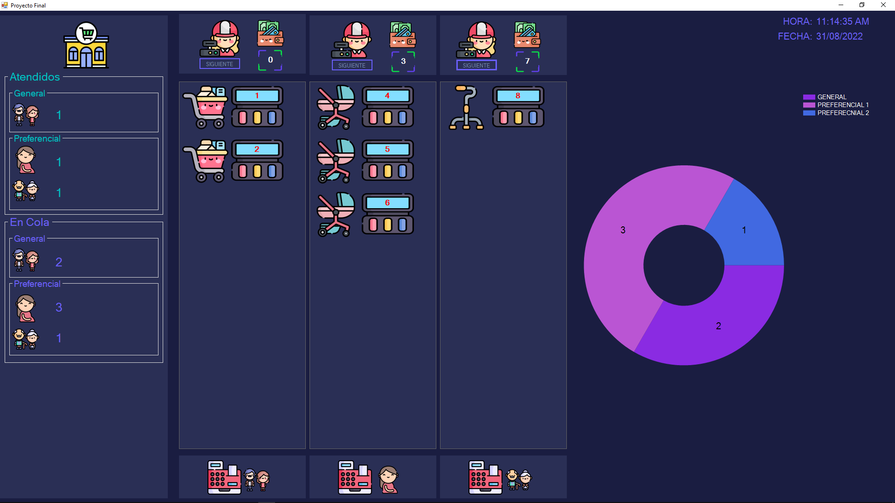

# C-Sharp-WForms_Queues-Supermarket
#Descripción
Este proyecto simula la cola de un supermercado utilizando la estructura de datos “Queue” en C#. Se utilizó Windows Forms para crear la interfaz gráfica. En la parte superior de la interfaz hay tres imágenes que representan a los cajeros. La primera columna es para atención general, la segunda columna es para atención preferencial a embarazadas y la tercera columna es para atención preferencial a mayores de edad. En la parte inferior de las colas hay tres imágenes que representan a las máquinas repartidoras de tickets. Cuando se presiona una de las máquinas, se agrega un elemento al final de la cola correspondiente.

En la parte derecha de la interfaz hay una gráfica circular que muestra el número de personas atendidas en cada cola. En la parte izquierda hay contadores más detallados que indican la cantidad de personas atendidas y por atender en cada cola. En la parte superior derecha hay un reloj que muestra la hora y fecha.

#Instalación
Para instalar y ejecutar este proyecto, sigue estos pasos:

Abre el proyecto en Visual Studio.
Ejecuta el proyecto haciendo clic en el botón “Iniciar” o presionando F5.
#Uso
Para usar el simulador de cola de supermercado, sigue estos pasos:

Ejecuta el proyecto en Visual Studio.
Haz clic en una de las máquinas repartidoras de tickets para agregar un elemento a la cola correspondiente.
Si quieres atender a una persona en una cola, haz clic en el botón “Siguiente” que se encuentra junto a la imagen del cajero correspondiente.
La cola se actualizará y verás que al lado del cajero hay una pantalla que muestra el número de ticket que está siendo atendido en ese momento.

